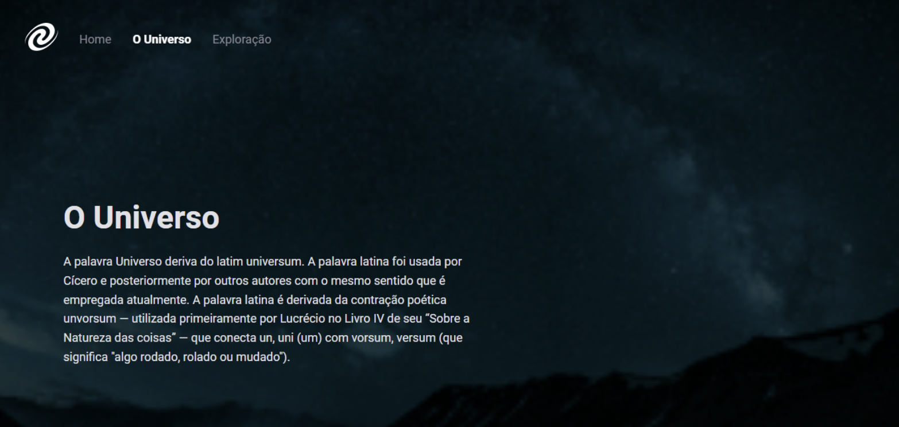
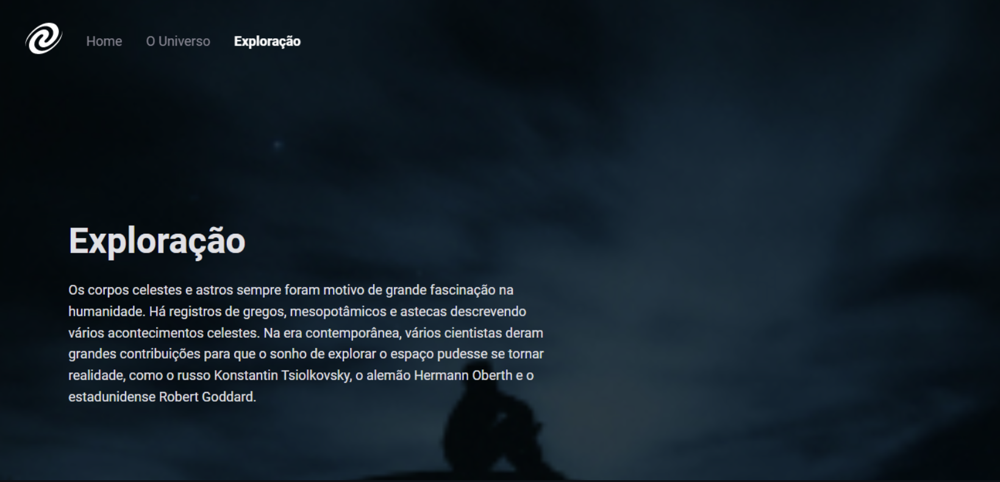

🪐 _SPA Universe_ 🇺🇸

_Improvement of the previous project in which I learned the concept of SPA (Single-Page Application) and made another application in practice._

- ES Modules;
- Clean Code Concepts
- Route mapping;
- Asynchronous and promises;
- Object orientation;
- DOM manipulation;
- Web APIs;
- Refactoring;
- Classes and much more.

# 📸 Screenshots of project: 

# ⚙️ Technologies 

- [HTML](./html)
- [CSS](CSS.com)
- [JavaScript](javascript.com)
- [JSON](json.com)

#### 🔗 [Online project](../index.html)

### 🗓️ September 2023

                  Feito com 💜 by BM